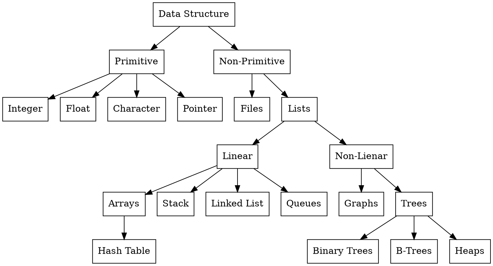

---
markdown:
  image_dir: /assets
  path: data_structure.md
  ignore_from_front_matter: true
  absolute_image_path: false
export_on_save:
  markdown: true
---
# 1. Data Structure

## Definition

+ It way is a of storing and organising data.
+ Allow performing operatios on data easily.
  
## Types of Data Structure

+ Primitive (built-in)
  + Integer
  + Float
  + Character
  + Pointer
+ Non-Primitive
  + Files
  + Lists
    + Linear
      + Arrays
      + Stack
      + Linked List
      + Queues
    + Non-Linear
      + Graphs
      + Trees

## Operations

|Operation| What does it means? |
|:---|:---|
| Creation  | Allocation of memory space for data elements.|
| Deletion  | Deallocation of memory space assigned to a specific data structure.|
| Selection | Accessing a particular data item in a data structure.|
| Insertion | Inserting data item in a data structure.|
| Updation  | Updating a data item by re-insertion at same place or deletion.|
| Sorting   | Arranging all the data items in a specific order.|
| Merging   | Combining tow or more data items in a single unit.|
| Traversing| Accessing all the data items at least once in a data structure.|