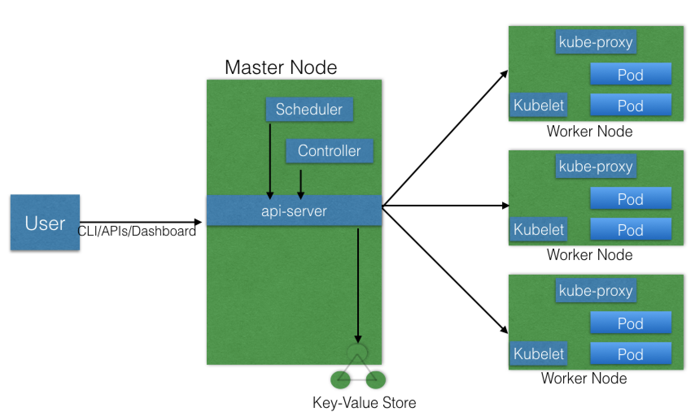
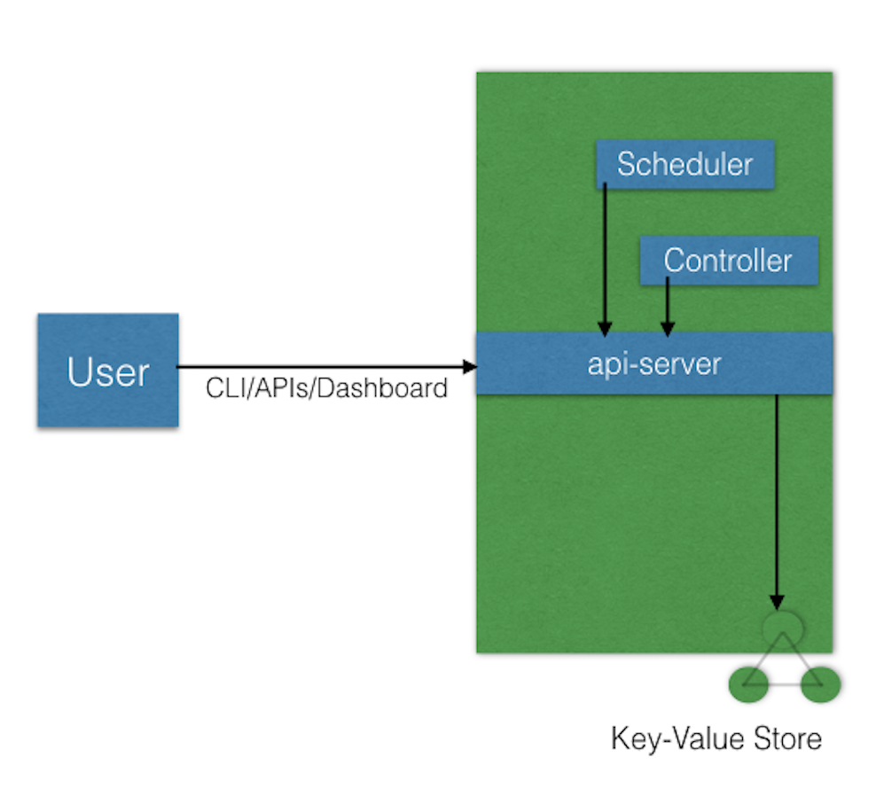
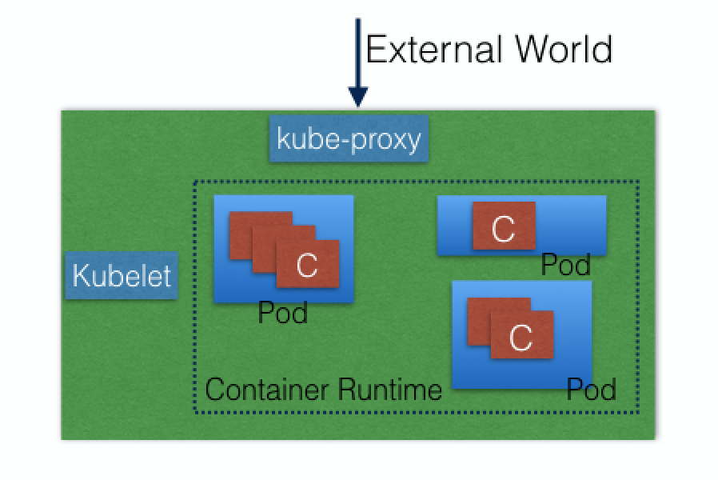

#### Kubernetes Architecture
 Kubernets have the following main components
+ One or more **master nodes**
+ One or more **worker nodes**
+ Distributed **key-value store** such as `etcd`

<strong>Fig. </strong>Kubernets Architecture

##### 1. Master Nodes 
+ Master node provides running environment for control panel.
+ Control panel manages the state of kubernetes cluster,
+ and all operation inside the cluster
+ Control panel have components with distinct role in cluster management.
+ All the user requests are send to master node and handeled by the control panel.
+ To ensure fault tolerance, master node replicas are added.
+ All the kubernets cluster data is saved in `etcd`.

##### 1.1. Master Node Components:
+ API Server
+ Scheduler
+ Controller Managers
+ etcd

<strong>Fig. </strong>Master node

##### 1.1.a API Server
+ All the tasks are coordinated by **`kube-apiserver`**
+ It interceps,validates and process the RESTful calls by users.
+ It is also the only component which can talk to etcd data store.
+ Before RESTful call's execution it reads the current cluster state,
+ and after execution it saved the new state to the etcd.
+ API server is highly configurable and allows custom API services.

##### 1.1.b. Scheduler
+ The **`kube-scheduler`**'s role is to assign new objects, such as pods, to nodes. 
+ Scheduling decisions are made based on
  + current Kubernetes cluster state
  + new object's requirements. 
+ All the required information is obtained form API Server
+ It also usages the API Server to get data from `etcd`. Data such as:
  + Resouces usage of each worker node in cluster
  + Current state of cluster etc.

##### 1.1.c. Controller Managers
+ These are control panel components on master node.
+ These Components manages controllers running on master node.
+ **Controllers** are watch-loops continuously running and comparing the cluster's 
  + desired state (provided by objects' configuration data)
  +  with its current state (obtained from etcd data store via the API server). 
+  The **`kube-controller-manager`** runs/manages controllers responsible
   +  To act when nodes become unavailable
   +  To ensure pod counts are as expected and
   +  To create endpoints, service accounts, and API access tokens.
+ The **`cloud-controller-manager`** runs controllers responsible
  + To interact with infrastructure of a cloud provider when nodes become unavailable
  + To manage storage volumes when provided by a cloud service, and 
  + To manage load balancing and routing.

##### 1.1.d. etcd
+ Distributed key-value store used to store
  + Kubernets cluster's state
  + Configuration details such as Subnets, ConfigMaps, Secrets
+ New data can be stored by appending only.
+ Only the API serveris allowed to communicate with etcd. 
+ etcd is written in the Go programming language.

##### 2. Worker node
+ Worker node provides running environment for client application.
+ Client application are encapsulated in container in Pods .
+ Pods are collection of containers, scheduled together.
+ Pods run in container runtime environment persent in worker node.
+ Pods are sheduled by Master node on worker node.
+ To access the application from outside we connect to worker nodem not master node.

<strong>Fig. </strong>Worker node

##### 2.1. Worker Node Components
+  Container Runtime
+ kubelet
+ kube-proxy
+ Addons for DNS, Dashboard, cluster-level monitoring etc.

##### 2.1.a. Container Runtime
+ They provide runtime environment for pods and containers.
+ Kubernets supports following container runtime:
  + Docker
  + CRO-o
  + containerd
  + rkt
  + rktlet

##### 2.1.b. kubulet
+ An agent running on each worker node.
+ Allows communication between
  + Control panel component on master node and
  + Container Runtime on worker node
+ It also monitors health of containers running inside pod.
+ It receives Pod definitions from the API server   and  Interacts with the container runtime on the node  to run containers associated with the Pod. 
+ kubelet connects to the container runtime using (CRI). 
  + `CRI: Container Runtime Interface`

##### 2.1.c. kube-proxy
+ It is a network agent, running on each worker node.
+ It is responsible for
  + dynamic updates
  + maintenance of all networking rules
+ It abstracts details of Pods networking and forwads connection to pods.

##### 2.1.d. ADDONS
+ Addons are cluster features and functionality not yet available in Kubernetes
+ Therefore implemented through 3rd-party pods and services.
  + `DNS`: Cluster DNS is a DNS server required to assign DNS records to Kubernetes objects and resources
  + `Dashboard`: A general purposed web-based user interface for cluster management
  + `Monitoring`: Collects cluster-level container metrics and saves them to a central data store
  + `Logging`: Collects cluster-level container logs and saves them to a central log store for analysis.

##### 3. Networking Challenges
+ A containerized microservices orchestrator is needs to address 4 distinct networking challenges:
  1. **Container-to-container communication** inside Pods
  2. **Pod-to-Pod communication**
     +  on the same node and
     +  across cluster nodes
  3. **Pod-to-Service communication**
     +  within the same namespace and
     +  across cluster namespaces
  4. **External-to-Service communication** for clients to access applications in a cluster.
