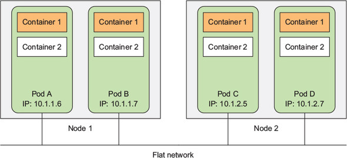

##### Pods

- Building blocks of kubernetes
- A node can have multiple pods
- Each pod have one or more containers
- Only one container per pod is adviced.
- All containers of a pod run under the same IPC namespace and can communicate through IPC.
- All containers of a pod share the same IP and communicate over different PORT.
- All pods in a Kubernetes cluster
  reside in a single flat, shared, network-address space.
- Every pod can access every other pod at the other pod’s IP address.
- No NAT (Network Address Translation) gateways exist between them.

<br/>

##### Flat inter-pod network



<br/>

##### Example YAML descriptor for pod

```yml
apiVersion: v1

kind: Pod

metadata:
  name: kubia-manual
spec:
  containers:
    - image: luksa/kubia
      name: kubia
      ports:
        - containerPort: 8080
          protocol: TCP
```

##### Organizing/Categorizing pods with labels

- A label is an arbitrary key-value pair you attach to a resource.
- Label is then utilized when selecting resources using label selectors.
- Resources are filtered based on whether they include the label specified in the selector.
- A resource can have more than one label, as long as the keys of those labels are unique within that resource.
- Label can be added to resources while creating as well as later.


<br/>

```yml
apiVersion: v1
kind: Pod
metadata:
  name: kubia-manual-v2
  labels:
    app: ui
    rel: stable
    creation_method: manual
    env: prod
spec:
  containers:
    - image: luksa/kubia
      name: kubia
      ports:
        - containerPort: 8080
          protocol: TCP
```

- AS shown in above conf, `app`, `rel`, `env`, `creation_method` can be used to select the pod.
- Adding a label to a pod:
  - `kubectl label po kubia-manual creation_method=manual`
- Overrinting a label:
  - ` kubectl label po kubia-manual-v2 env=debug --overwrite`
- Listing pod based on label
  - `kubectl get po -l creation_method=manual`
  - `kubectl get po -l '!env'`
  - `app=pc,rel=beta ` : selecting based on multiple labels
  - Make sure to use single quotes around label value, so the bash shell doesn’t evaluate the exclamation mark.

<br/>

##### Scheduling pods to specific nodes

- A `nodeSelector` is used in `yml` configuration to schedule a pod to specific node.
- It is added under `spec` section.
```yml
apiVersion: v1
kind: Pod
metadata:
  name: kubia-gpu
spec:
  nodeSelector:
    gpu: "true" # The scheduler will only choose among the nodes that contain the `gpu=true` label.

  containers:
    - image: luksa/kubia
      name: kubia
```
  <br/>


##### Namespaces
+  Multiple namespaces allows to split complex systemsin  smaller distinct groups.
+ Also be used for
    + Separating resources in a multi-tenant environment,
    + Splitting up resources into production, development, and QA environments,
    +  or in any other way you may need. 
+ Discovering other namespaces:
    + `kubectl get ns`
+ Discovering all pods within a namespace:
    + `kubectl get po --namespace kube-system`
+ Creating a namespace:
    + Using `yml` file:
        + ```yml
            apiVersion: v1
            kind: Namespace
            metadata:
              name: custom-namespace
          ```
    + Using kubectl command
        +   `kubectl create namespace custom-namespace`
  <br/>

##### Common commnads related to pods

- `kubectl explain pods`
- `kubectl explain pod.spec`
- `kubectl create -f kubia-manual.yaml`
- `kubectl get po kubia-manual -o yaml`
- `kubectl get po kubia-manual -o json`
- `kubectl get pods`
- `kubectl logs kubia-manual -c kubia`
- `kubectl port-forward kubia-manual 8888:8080`
- ``
- ``
- ``
- ``
- ``
- ``
