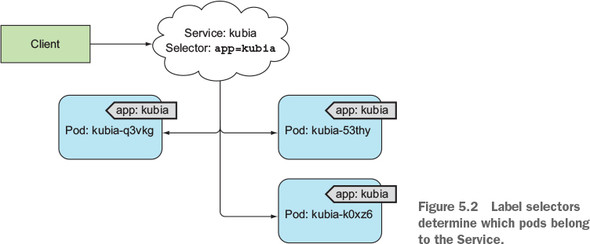

##### SERVICES
+ `Service` is a resource type
+ It is used to define a single point of entry to group of pod providing same service.
+ Requests made are forwarded randomly to backing pods. 
+ To redirectedall requests to the same pod every time `  sessionAffinity: ClientIP` is set under `spec`.



##### Creating a service
+ Using kubectl command:
    `kubectk expose .....`
+ Using `yml` descriptor
    + ```yml
      apiVersion: v1
      kind: Service
      metadata:
        name: kubia
      spec:
        ports:
        - port: 80
          targetPort: 8080
        selector:
          app: kubia
      ```
##### Getting all services
+ `kubectl get svc`

<br/>

##### Exposing multiple ports in the same service
+ Single service can be used to expose multiple ports of pods.
+ Example:
```yml
apiVersion: v1
kind: Service
metadata:
  name: kubia
spec:
  ports:
                #Forward both port 80 and 443 to the pod’s ports 8080 and 8443
  - name: http
    port: 80
    targetPort: 8080
  - name: https
    port: 443
    targetPort: 8443
  selector:
    app: kubia
```
+ When creating a service with multiple ports,we must specify a name for each port.
+ The label selector applies to the service as a whole
    + it can’t be configured for each port individually.
+ If we want different ports to map to different subsets of pods, you need to create two services.

<br/>

##### Using named ports
+ We can also refer to target ports in Service using name rather than number.
+ This makes the service spec slightly clearer, especially if the port numbers aren’t well-known.
+ For example, suppose your pod defines names for its ports as shown in the following listing.

```yml
kind: Pod
spec:
  containers:
  - name: kubia
    ports:
    - name: http # name Will be used in service descriptor (1)
      containerPort: 8080
    - name: https # name Will be used in service descriptor (2)
      containerPort: 8443
```

+ We can then refer to those ports by name in the service spec, as shown in the following listing.
```yml
apiVersion: v1
kind: Service
spec:
  ports:
  - name: http
    port: 80
    targetPort: http # Used name from pod descriptor rather than 8080 (1)
  - name: https
    port: 443
    targetPort: https # Used name from pod descriptor rather than 8443 (2)
```