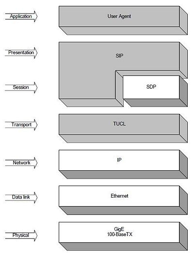

## SIP : Session Initial Protocal

### Introduction:
+ It is one of the most common protocol for VOIP technology.
+ It is an application layer signalling protocol.
+ This protocol is used to create, modify and terminate a multimedia session over IP.
+ It embodies `client-server` architecture and uses `URI`, `URL` from HTTP & header Style from `SMTP`.
+ It uses the `SDP (Session Description Protocol` and `RTP (Real Time Transport Protocol)` for delivering multimedia protocol network.
+ It supports both unicast and multicast communication.
+ It is defined in RFC 3261.

<figure align="center">
  
  <figcaption>SIP Protocol Architecture</figcaption>
</figure> 

----------

